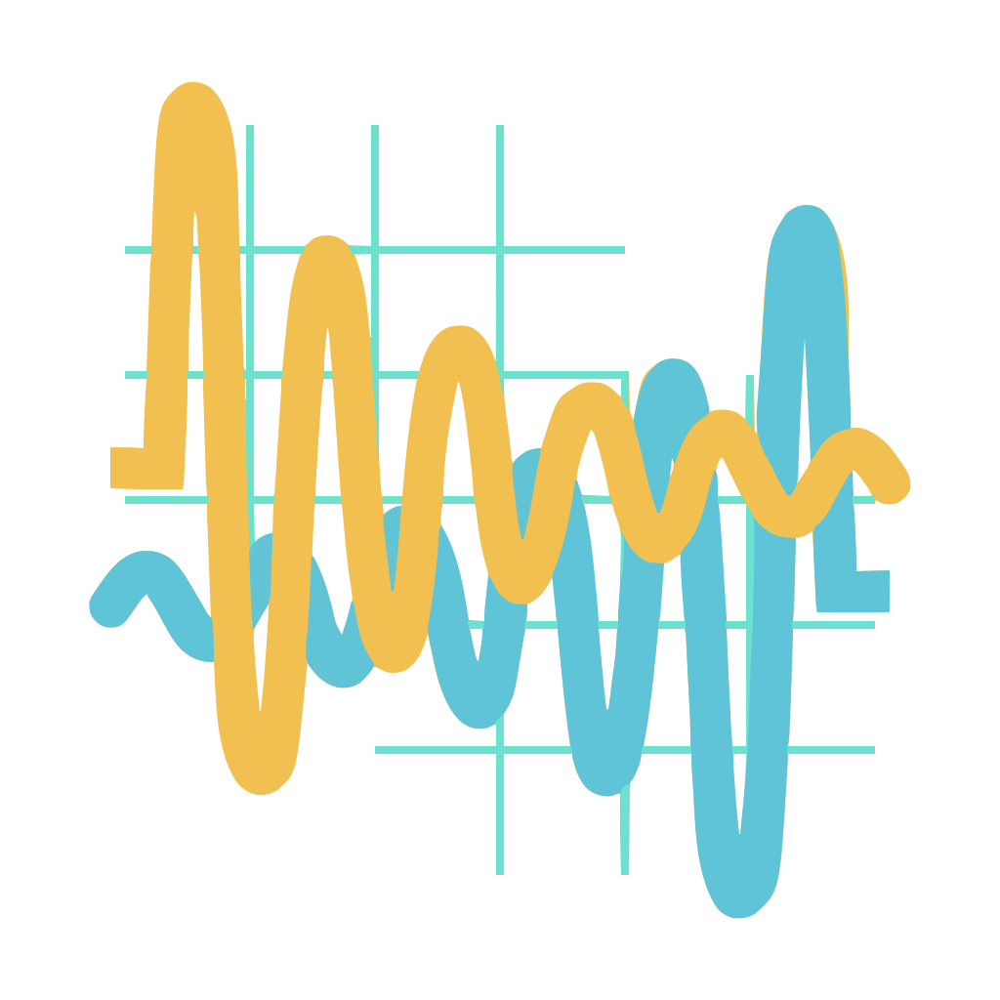
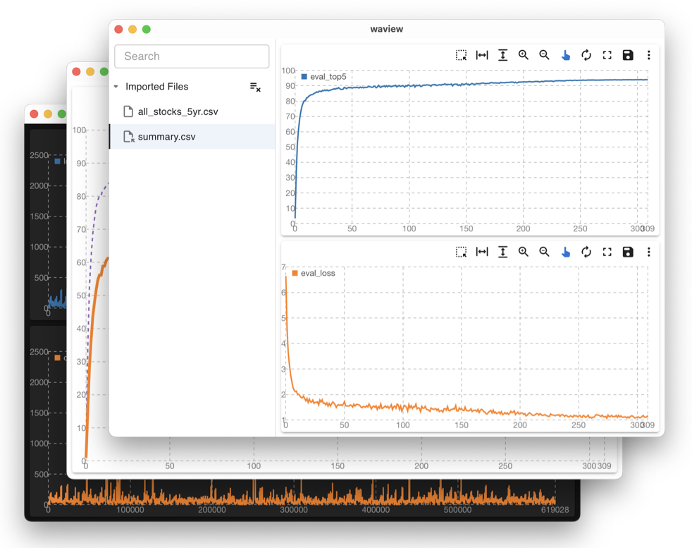

<!-- @format -->

<div>
  <p align="center">
    
  </p>
  <h3 align="center">
    Simple And Tiny CSV Waveform Viewer
  </h3>
  <p align="center">
    Built with <a href="https://tauri.app">Tauri</a> and <a href="https://mui.com">MUI</a> to inspect waveforms in CSV files. <br />
    Optimized for minimal size and waveform rendering. 
  </p>
  
</div>

## Features

1. 🦥 Simple: Built with simplicity in mind, making it easy to use and understand.

2. 🐜 Tiny: Optimized for minimal size, less than 2M bundle size.

3. 🥷 Customizable: Easy to customize the waveform style and configuration.

4. 🗿 Multi-language: Support for multiple languages, including English, Chinese.

5. 🛹 Multi-platform: Support for multiple platforms, including Windows, macOS, and Linux.

```bash
# The code of waview is less than 2000 lines of code.
===============================================================================
 Language            Files        Lines         Code     Comments       Blanks
===============================================================================
 CSS                     1           13           10            1            2
 HTML                    1           16           13            1            2
 JavaScript              1           18           15            1            2
 Rust                    6          262          224            0           38
 TSX                    17         1413         1233           21          159
 TypeScript              7          277          234           14           29
===============================================================================
 Total                  33         1999         1729           38          232
===============================================================================
```

## How to use

1. Drag a CSV file with columns of numerical values to the app. For example:

```bash
epoch,train_loss,eval_loss,eval_top1,eval_top5
0,6.85080099105835,6.6424625,0.8720000042724609,3.3400000009155275
1,6.17962772505624,4.606329375,14.981999956054688,33.540000026855466
2,5.6329280989510675,3.661601875,28.136000048828127,52.41000006835937
3,5.105638538088117,3.17984125,36.43999999023438,61.622000014648435
4,4.978073426655361,2.793064375,43.54799995605469,68.5580000366211
5,4.5689898899623325,2.530873125,47.813999946289066,73.12199998535156
```

### Shortcuts

| Shortcut                          | Action                 |
| --------------------------------- | ---------------------- |
| ⌘ + , (Ctrl + , on Windows/Linux) | Open Preferences       |
| ⌘ + N (Ctrl + N on Windows/Linux) | Toggle Split Waveforms |
| ⌘ + O (Ctrl + O on Windows/Linux) | Open Files             |
| ⌘ + D (Ctrl + D on Windows/Linux) | Display Imported Files |

## Why build this?

1. ⛷️ Learn: Learn about [Tauri](https://tauri.app), [React](https://react.dev), [Rust](https://www.rust-lang.org), and Modern APP development lifecycle.

2. 🔭 Explore: Explore some CSV files I have.

3. 🤷‍♂️ I have no idea.
